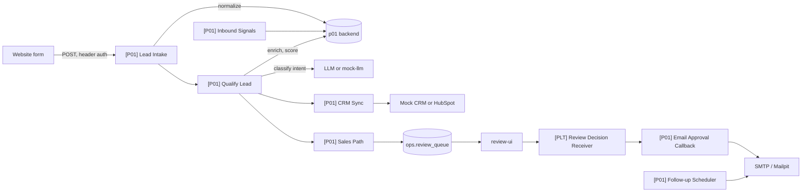

# Spec 01: AI Lead Qualification and Sales Automation (P01)

Folder: `projects/p01-lead-qualification`
Public title: Production AI Lead Qualification and Sales Automation with n8n

## 1. Problem (README story)

A B2B services company receives inbound leads from its website form. Sales answers slowly, spends time on spam, students, and job seekers, and good leads get a generic reply days later. The same person submits twice and gets two emails. When the CRM API is down, leads disappear.

## 2. Outcome

- Every valid lead is stored within seconds, scored with an explainable breakdown, routed, and synced to the CRM.
- High-scoring leads get a personalized first email drafted by an LLM and approved by a person before sending.
- Follow-ups run until the lead replies, books a meeting, unsubscribes, or bounces.
- Duplicates, CRM outages, rate limits, LLM failures, and prompt injection are handled and tested.

## 3. Scope

In: form webhook intake, validation, normalization, dedupe, company enrichment (mock provider plus optional real adapter), LLM intent classification, deterministic scoring, routing, CRM sync (mock CRM plus a HubSpot branch), sales notification, human approval of the first email, follow-up sequence, inbound signals (reply, booking, bounce, unsubscribe), audit trail. Leads in Finnish, Swedish, and English.

Out: a real website, scraping any site, purchased lead data, a CRM UI, outbound cold prospecting.

## 4. Architecture



## 5. Data model (schema `p01`)

`leads`: `id uuid`, `correlation_id`, `email_normalized citext unique`, `name`, `company_name`, `company_domain`, `is_free_mail bool`, `country`, `language` (fi, sv, en, other), `consent_marketing bool`, `consent_ts`, `status` (new, qualified, nurture, archived, contacted, replied, meeting_booked, unsubscribed, bounced, invalid, spam), `score int`, `score_breakdown jsonb`, `route`, `llm_status`, `crm_id`, `crm_sync_status` (pending, synced, failed), `owner`, `created_at`, `updated_at`.

`submissions`: `id`, `lead_id`, `submission_id text unique` (from form, or derived hash when missing), `raw_payload jsonb` (retention 90 days), `ip_hash`, `received_at`. One lead can have many submissions.

`enrichment_cache`: `domain pk`, `provider`, `data jsonb`, `fetched_at` (TTL 30 days).

`llm_calls`: `id`, `lead_id`, `purpose` (classify, draft_email), `prompt_version`, `model`, `output jsonb`, `valid bool`, `error`, `tokens_in`, `tokens_out`, `latency_ms`, `created_at`.

`email_messages`: `id uuid` (also used as idempotency key for sending), `lead_id`, `kind` (first_contact, followup, nurture), `language`, `subject`, `draft_text`, `final_text`, `status` (draft, pending_approval, approved, rejected, sending, sent, bounced, failed), `review_id`, `smtp_message_id`, `sent_at`.

`followups`: `id`, `lead_id`, `step int`, `due_at`, `status` (scheduled, sent, cancelled), `cancel_reason`. Index `(status, due_at)`.

`suppression_list`: `email_normalized pk`, `reason` (unsubscribed, bounced, manual), `created_at`.

`activities`: `id`, `lead_id`, `type`, `data jsonb`, `created_at`.

`settings`: `key pk`, `value jsonb` (crm_provider, notify_channel, quiet_hours, followup_steps, auto_email_enabled, owner_email).

## 6. Backend (FastAPI)

All endpoints require the internal token held in an n8n Header Auth credential.

| Endpoint | Behaviour |
|---|---|
| `POST /v1/leads/normalize` | Trim, lowercase email, syntax check (email-validator), free-mail and disposable domain detection (static lists in repo with source noted), optional MX check (off in CI), phone to E.164 (phonenumbers, default region FI), language hint |
| `GET /v1/enrich?domain=` | Provider interface: `mock` (fixtures) and optional real adapter via `.env`; uses `enrichment_cache` |
| `POST /v1/score` | Pure function over `config/scoring.yaml`; returns `score`, `breakdown`, `route`, `reasons` |
| `POST /v1/email/check` | Checks an LLM draft: length, banned phrases, `facts_used` subset of allowed facts, unsubscribe placeholder present |
| `GET /v1/unsubscribe/{token}` | HMAC-signed token, adds to suppression list, returns a plain page in the lead's language |
| `/mock-crm/*` | Enabled only when `MOCK_CRM=true`. Minimal contacts and companies API with search by email, create, update, notes. Honours flaky modes (500, 429 with Retry-After, 401, latency) |

Scoring config (demo defaults, documented as such):

```yaml
version: 1
max_score: 100
components:
  company_size:     {max: 25, bands: {"1-10": 5, "11-50": 15, "51-200": 25, "201-1000": 20, "1000+": 10, unknown: 5}}
  industry_fit:     {max: 20, fit: [software, saas, manufacturing, logistics], partial: [retail, public_sector], fit_points: 20, partial_points: 10, other_points: 0}
  budget:           {max: 20, form_field: budget_range, bands: {"<5k": 0, "5k-20k": 10, "20k-50k": 16, "50k+": 20, unknown: 5}}
  urgency:          {max: 15, form_field: timeline, bands: {now: 15, "1-3 months": 10, "3-6 months": 5, exploring: 2, unknown: 3}, llm_fallback_field: urgency_hint}
  ai_qualification: {max: 20, intent_points: {demo_request: 20, pricing: 16, partnership: 8, other: 4, support: 0, job_application: 0, spam: 0}}
routes:
  - {name: sales, min: 80}
  - {name: nurture, min: 50}
  - {name: archive, min: 0}
overrides:
  - {when: {intent: spam}, route: archive}
  - {when: {intent: job_application}, route: hr_forward}
  - {when: {intent: support}, route: support_forward}
  - {when: {is_free_mail: true}, cap_score: 60}
  - {when: {llm_status: failed}, cap_route: nurture}
```

LLM classification output schema:

```json
{
  "intent": "demo_request | pricing | partnership | support | job_application | spam | other",
  "urgency_hint": "now | soon | later | unknown",
  "language": "fi | sv | en | other",
  "summary": "string, max 280 chars",
  "fit_signals": ["enum values, max 5"],
  "injection_suspected": "boolean"
}
```

## 7. Workflows

| Workflow | Trigger | Responsibility |
|---|---|---|
| `[P01] Lead Intake` | Webhook `POST /webhook/p01/leads` | Validate, normalize, dedupe, store, respond |
| `[P01] Qualify Lead` | Sub-workflow | Enrich, classify, score, route |
| `[P01] CRM Sync` | Sub-workflow | Upsert contact and company, activity notes |
| `[P01] Sales Path` | Sub-workflow | Notify sales, draft email, enqueue review |
| `[P01] Email Approval Callback` | Sub-workflow (from review receiver) | Send approved email, schedule follow-ups |
| `[P01] Nurture Path` | Sub-workflow | Templated email only with consent |
| `[P01] Follow-up Scheduler` | Schedule, every 10 min | Send due follow-ups inside quiet-hours window |
| `[P01] Inbound Signals` | Webhook `POST /webhook/p01/signals/{type}` | Reply, booking, bounce |
| `[P01] Reconcile` | Schedule, hourly | Re-run leads stuck in `new` or `crm_sync_status = pending` |

Node outlines:

`[P01] Lead Intake`
1. Validate payload: required fields, message at most 5000 chars, honeypot field empty. Respond 400 with error codes on failure.
2. Normalize through the backend.
3. Claim idempotency key in `ops.idempotency_keys` (scope `p01.submission`, key = `submission_id` or sha256 of email, message, and 10-minute bucket). If no row returned, respond 200 `{status: "duplicate", lead_ref}` and stop.
4. Upsert lead by `email_normalized`, insert submission. Mark `returning_contacted` if the lead was contacted in the last 30 days.
5. Respond 202 `{lead_ref}`.
6. Log, then call `[P01] Qualify Lead`.

`[P01] Qualify Lead`
1. Suppression check. Suppressed leads still sync to CRM but get no email.
2. Enrich (skipped for free-mail). Failure continues with `unknown` values and a warn log.
3. Classify with the LLM (prompt `prompts/classify_lead.v1.md`, 30 s timeout, schema validation, one retry with the error). After a second failure: `llm_status = failed`, no AI points.
4. Score through the backend. Persist score and breakdown. Audit records: `llm` actor for classification, `system` actor for score.
5. Route with a Switch: `sales`, `nurture`, `archive`, `hr_forward`, `support_forward`.
6. Always call `[P01] CRM Sync`.

`[P01] CRM Sync`
1. Read `crm_provider` from settings. Branch `mock` uses HTTP Request to the mock CRM; branch `hubspot` uses the native HubSpot node (search by email, then create or update, associate company). The HubSpot branch is tested manually with a free developer account and documented; CI uses `mock`.
2. Existing contact with an owner and activity in the last 30 days: set `already_contacted`, block automated email, notify the owner.
3. Errors go to classification: short retries for transient errors, otherwise DLQ with `retry_workflow_id` pointing to this workflow; lead keeps `crm_sync_status = pending`.

`[P01] Sales Path`
1. Notify sales through `[PLT] Notify` with name, company, score breakdown, summary, CRM link.
2. Draft first email with the LLM (`prompts/first_email.v1.md`). Allowed facts only: lead message, company name, enrichment industry and size, sender signature. Rules: at most 120 words, lead's language, no prices, no promises, no invented facts. Output `{subject, body, facts_used[]}`, then `POST /v1/email/check`.
3. Insert into `ops.review_queue` (`kind = lead_email_approval`, callback `[P01] Email Approval Callback`). Stop. No waiting.

`[P01] Email Approval Callback`
- Approved (possibly edited): check suppression again, set `sending`, send via SMTP with `List-Unsubscribe` header, store message ID, set `sent`, schedule follow-ups, add CRM activity, audit with the human actor.
- Rejected: set status, audit, optional note to the owner.

`[P01] Follow-up Scheduler`
- Claims due rows with `FOR UPDATE SKIP LOCKED LIMIT 100`. Cancels when the lead is replied, booked, unsubscribed, bounced, or suppressed. Otherwise renders the templated follow-up in the lead's language, sends, schedules the next step or finishes.
- Sends only on weekdays between 08:00 and 18:00 Europe/Helsinki (setting). Outside the window, moves `due_at` to the next window.

`[P01] Inbound Signals`
- Header Auth per source. Booking (payload modelled on a common scheduling tool, fixture only), reply (simulated parsed inbound email), bounce (provider-style fixture). Updates status, cancels follow-ups, updates CRM, notifies owner.

## 8. Failure modes and edge cases

| ID | Scenario | Expected behaviour | Test |
|---|---|---|---|
| F01 | Same submission delivered twice concurrently | One lead, one submission, one CRM upsert; second request gets 200 duplicate | `test_concurrent_duplicate` |
| F02 | Same person submits again three days later | Lead updated, submission recorded, no second first-contact email, owner notified | `test_returning_lead` |
| F03 | Invalid email syntax | 400, nothing stored | `test_invalid_email` |
| F04 | Disposable email domain | Stored as `invalid`, no email, no CRM | `test_disposable_domain` |
| F05 | Honeypot filled | 202 returned (no signal to bots), stored as `spam`, nothing else happens | `test_honeypot` |
| F06 | Enrichment 500 or timeout | Continues with unknown values, warn log | `test_enrichment_down` |
| F07 | LLM timeout or invalid JSON twice | Deterministic score without AI points, route capped at nurture, flagged | `test_llm_failure_fallback` |
| F08 | Prompt injection in message | Route and score equal the baseline for the same lead without the injection text; `injection_suspected` stored | `test_prompt_injection` |
| F09 | CRM 500 or timeout | Short retries, then DLQ; recovered by DLQ Retrier after the mock heals; one contact created | `test_crm_outage_recovery` |
| F10 | CRM 429 with Retry-After | Waits as instructed; request count stays within limit | `test_crm_rate_limit` |
| F11 | CRM 401 | No retry, alert, leads stay pending | `test_crm_auth_failure` |
| F12 | Lead already contacted in CRM | No automated email, owner notified | `test_already_contacted` |
| F13 | Bounce signal | Status bounced, suppressed, follow-ups cancelled | `test_bounce` |
| F14 | Unsubscribe link used | Suppressed; next follow-up not sent | `test_unsubscribe` |
| F15 | Reply or booking signal | Follow-ups cancelled, CRM updated | `test_booking_stops_sequence` |
| F16 | Reviewer rejects draft | Nothing sent, audit record | `test_reject_draft` |
| F17 | Draft pending over 24 h | Reminder notification; never auto-sent | `test_review_reminder` |
| F18 | SMTP down at send time | Message stays unsent, retried via DLQ, never sent twice | `test_smtp_outage_no_double_send` |
| F19 | Worker killed during Qualify Lead | Reconcile job re-runs the lead; idempotent steps mean no duplicates | chaos script `worker-kill-p01` |
| F20 | Finnish and Swedish leads | Classification works; email in the lead's language | `test_multilingual` |

## 9. Demo (`make demo P=p01`)

1. Send 20 fixture leads: duplicates, spam, injection, free-mail, Finnish, Swedish, English.
2. Print a table of outcomes (route, score, CRM status, email status).
3. Open review-ui and approve two drafts, reject one.
4. Show sent mail in Mailpit.
5. Set the mock CRM to 500, send five leads, show DLQ rows, heal the mock, show recovery.
6. Send a booking signal and show the follow-ups cancelled.

## 10. Measurements for `docs/results.md` (script `scripts/measure_p01.py`)

- Intake response time p50 and p95 (webhook to 202).
- Submission to CRM record p50 and p95 (mock CRM).
- Routing agreement on 200 labeled synthetic leads (generator writes the expected route before the run).
- LLM tokens and cost per lead for the model used (price source and date noted).
- Share of leads needing human review.

## 11. Tasks

| ID | Task |
|---|---|
| P01-T01 | Migrations for `p01`, settings seed |
| P01-T02 | Backend skeleton: config, auth, health, logging, Dockerfile |
| P01-T03 | `/normalize` with tests (Finnish and Swedish names, +358 numbers, free-mail and disposable lists) |
| P01-T04 | `/score` and `scoring.yaml` with at least 30 table-driven cases, including overrides and caps |
| P01-T05 | Enrichment interface, mock fixtures, cache |
| P01-T06 | Mock CRM with failure modes; HubSpot branch with `TODO(verify)` until tested manually |
| P01-T07 | Prompts v1, schemas, mock-llm fixtures, `/email/check` |
| P01-T08 | `[P01] Lead Intake` and e2e for F01, F03, F04, F05 |
| P01-T09 | `[P01] Qualify Lead`, `[P01] CRM Sync`, e2e for F06 to F12 |
| P01-T10 | Sales Path, review-ui template for email approval, Approval Callback, SMTP, e2e for F16 to F18 |
| P01-T11 | Nurture Path, Follow-up Scheduler, quiet hours, e2e for F14 |
| P01-T12 | Inbound Signals, unsubscribe endpoint, e2e for F13, F15 |
| P01-T13 | Reconcile workflow and worker-kill chaos script (F19) |
| P01-T14 | Synthetic lead generator (200 labeled leads, fi, sv, en), measurement script, `docs/results.md` |
| P01-T15 | README, diagrams, screenshots, ADRs, failure-modes doc, demo recording checklist |
| P01-T16 | DoD review and tag `p01-v1.0.0` |

## 12. Do and do not (P01)

Do:
- Store the score breakdown for every lead and show it in the sales notification.
- Keep the scoring config readable by a non-engineer; the README explains how a client would tune it.
- Use invented, clearly fictional company names in fixtures.
- Mark a lead as contacted only after the email is actually sent.

Do not:
- Let the LLM decide the route on its own or exceed its score cap.
- Send any LLM-written email without human approval.
- Use Wait nodes for follow-ups.
- Send email outside quiet hours or to suppressed addresses.
- Keep raw form payloads longer than the retention period.
- Scrape websites or LinkedIn for enrichment.
