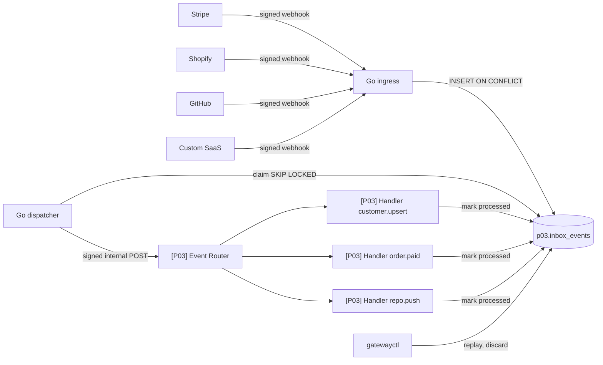
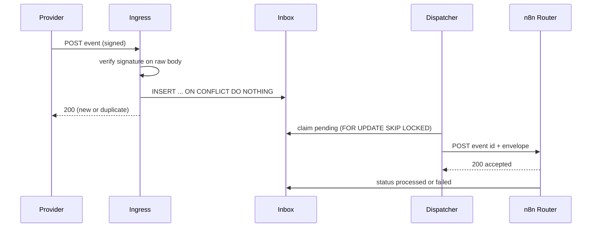

# Spec 03: Event-Driven Webhook Integration Platform (P03)

Folder: `projects/p03-webhook-gateway`
Public title: Event-Driven Webhook Integration Platform with n8n and Go

## 1. Problem (README story)

A company receives webhooks from Stripe, Shopify, GitHub, and an internal SaaS. Events get lost when the automation server restarts, providers retry and cause double emails and double fulfilment, events arrive out of order, and nobody can replay a failed event after fixing a bug.

## 2. Outcome

- Every authentic event is stored durably before the provider gets a 2xx.
- Delivery to processing is at-least-once; handlers are idempotent, so duplicate deliveries cause one side effect.
- Stale out-of-order updates never overwrite newer state.
- Failed events are retried with backoff, then parked as dead and replayable after a fix.
- Demo: stop n8n, send 1000 events, start n8n, show zero lost and zero processed twice.

Wording rule: never write "exactly-once". Write "at-least-once delivery with idempotent handlers".

## 3. Scope

In: Go ingress with per-source signature verification, durable inbox, Go dispatcher, n8n router and handlers, replay CLI, simulator, load test, metrics, retention purge.

Out: a UI for events (the CLI and Grafana in P04 are enough), schema registry, Kafka.

## 4. Architecture

Design reasons (write as ADRs): ingress lives outside n8n so providers get fast, durable acknowledgement even when n8n is down or restarting; signature checks need the raw body and constant-time comparison, which are simpler and testable in Go; n8n does normalization, routing, and business handlers, which is what it is good at.

## 5. Data model (schema `p03`)

`inbox_events`: `id uuid`, `source text`, `external_event_id text`, `event_type text`, `source_ts timestamptz`, `received_at`, `headers jsonb` (allow-listed headers only), `payload jsonb`, `status` (pending, dispatched, processed, failed, dead, ignored, discarded), `attempts int`, `next_attempt_at`, `dispatched_at`, `processed_at`, `last_error`, `replay_of uuid null`. Unique `(source, external_event_id)`. Indexes `(status, next_attempt_at)`, `(received_at)`.

`customers`: `source`, `external_id`, `email_hash`, `name`, `last_source_ts`, `data jsonb`. Unique `(source, external_id)`.

`fulfilment_requests`: `order_key unique` (source plus order id), `status`, `created_at`.

`repo_events`: `delivery_id unique`, `repo`, `ref`, `commits int`, `pushed_at`.

`processed_effects`: `effect_key text pk` (for example `order.paid:shopify:123:notify`), `created_at`. Handlers claim effect keys before side effects.

## 6. Go ingress

Routes: `POST /hooks/{source}` for `stripe`, `shopify`, `github`, `custom`.

Per request:
1. Read raw body with a 1 MB limit (413 above).
2. Verify the signature for the source (secrets from env):
   - Stripe: use the official stripe-go webhook verification, including timestamp tolerance.
   - GitHub: HMAC SHA-256 of the raw body, compared with the `X-Hub-Signature-256` header.
   - Shopify: base64 HMAC SHA-256 of the raw body, compared with the HMAC header.
   - Custom: HMAC SHA-256 over `timestamp.body` with a timestamp header and 5-minute tolerance.
   - Verify all header names in the providers' current docs; mark `TODO(verify)` until done.
   - Constant-time comparison. 401 on failure. Do not store the body of failed requests; count them in metrics.
3. Extract the external event id (Stripe event id in the body, GitHub delivery id header, Shopify webhook id header, custom header) and event type.
4. `INSERT ... ON CONFLICT (source, external_event_id) DO NOTHING`.
5. Respond 200 for new and duplicate events alike. If the database is unavailable respond 503 so the provider retries. Never 2xx without a committed row.

Metrics: `events_received_total{source,result}` (new, duplicate, bad_signature, too_large, db_error), `ingress_request_duration_seconds`, `inbox_pending` gauge, `inbox_oldest_pending_age_seconds` gauge (the key SLI).

## 7. Go dispatcher

- Loop: claim up to N pending rows where `next_attempt_at <= now()` with `FOR UPDATE SKIP LOCKED`, set `dispatched`, POST to the n8n router webhook with an internal HMAC signature.
- n8n responds 200 when it has accepted the event. Non-2xx or timeout: attempts plus one, next attempt with full-jitter backoff (base 2 s, cap 5 min), after max attempts `dead`.
- Visibility timeout: rows in `dispatched` longer than 5 minutes without `processed` or `failed` go back to `pending`. This is why handlers must be idempotent.
- Graceful shutdown: stop claiming, finish in-flight requests, exit.
- Several dispatcher replicas must be safe; there is a test with 3 replicas.

## 8. n8n workflows

| Workflow | Trigger | Responsibility |
|---|---|---|
| `[P03] Event Router` | Webhook from dispatcher | Verify internal signature, normalize, validate, route, respond 200 |
| `[P03] Handler customer.upsert` | Sub-workflow | Upsert customer only if `source_ts` is newer; sync mock CRM |
| `[P03] Handler order.paid` | Sub-workflow | Create fulfilment request once; notify |
| `[P03] Handler repo.push` | Sub-workflow | Record push; post summary to notify channel |
| `[P03] Handler unknown` | Sub-workflow | Mark `ignored` with a log entry (not an error) |
| `[P03] Retention Purge` | Schedule, daily | Null out payloads older than 30 days (config), keep metadata |

Normalization:
- Per-source mapping to an envelope using CloudEvents 1.0 attribute names: `specversion`, `id`, `source`, `type`, `time`, `subject`, `data`.
- Mapping logic lives in `code-snippets/normalize_event.js`, tested with Vitest against real-format fixture payloads for each source.
- Internal types: `customer.upsert` (from Stripe customer created or updated, Shopify customer create or update), `order.paid` (from Stripe checkout completed, Shopify order paid), `repo.push` (GitHub push), `custom.*`.

Handlers:
- Claim an effect key in `processed_effects` before each side effect (notification, fulfilment, CRM call). If the key exists, skip that effect.
- On success: `UPDATE inbox_events SET status = 'processed' WHERE id = $1 AND status = 'dispatched'`.
- On failure: set `failed` with the error class; the dispatcher schedules the retry.

## 9. Tools

`gatewayctl` (Go CLI):
- `list --status dead --since 24h`, `show <id>` (payload redacted by default), `replay <id>`, `replay --status dead --source stripe --since 2h`, `discard <id> --reason`.
- Replay creates an audit record and resets the row to `pending` with `replay_of` noted. Replaying a processed event is allowed and must be harmless.

`sim` (Go CLI):
- `sim send --source stripe --fixture customer_created --count 1000 --concurrency 50`
- `--duplicates 50` sends the same event 50 times concurrently.
- `--out-of-order` sends updates with shuffled timestamps.
- `--bad-signature`, `--oversize`.
- Signs with test secrets from `.env`.

Manual real-provider paths (documented, optional): Stripe CLI in test mode forwarding to the local ingress; a GitHub test repository webhook through a tunnel. Never required for CI.

## 10. Failure modes and edge cases

| ID | Scenario | Expected behaviour | Test |
|---|---|---|---|
| F01 | Provider retries an event | 200, one row, one side effect | `test_provider_retry` |
| F02 | 50 concurrent duplicates | One row, one side effect | `test_duplicate_storm` |
| F03 | Bad signature | 401, nothing stored, metric incremented | `test_bad_signature` |
| F04 | Timestamp outside tolerance | 401 | `test_replayed_signature` |
| F05 | Body over 1 MB | 413 | `test_oversize` |
| F06 | Unknown source | 404 | `test_unknown_source` |
| F07 | Unknown event type | Stored, marked `ignored` | `test_unknown_type` |
| F08 | n8n down for 5 minutes during 1000 events | All stored, pending grows, drains after recovery, 1000 processed, zero duplicates | `test_n8n_down_drain` |
| F09 | Handler dependency 500 | Retries with backoff, `dead` after max, replay after fix gives one side effect | `test_handler_failure_replay` |
| F10 | Out-of-order customer updates | Older update ignored, logged as stale | `test_out_of_order` |
| F11 | Postgres down | Ingress returns 503, provider retries, nothing lost after recovery | `test_db_down_503` |
| F12 | Dispatcher killed mid-dispatch | Visibility timeout re-dispatches, handler idempotency prevents duplicates | chaos `dispatcher-kill` |
| F13 | Replay of processed event | No additional side effects | `test_replay_processed` |
| F14 | Three dispatcher replicas | No row dispatched twice at the same time | `test_multi_dispatcher` |

## 11. Load test

- k6 scripts in `projects/p03-webhook-gateway/load/`. Scenarios: steady 50 rps for 5 minutes, burst of 500 rps for 30 seconds, duplicate-heavy mix.
- Report ingress p50, p95, p99 latency, error rate, time to drain the burst, and hardware used in `docs/results.md`. No numbers without a run.

## 12. Tasks

| ID | Task |
|---|---|
| P03-T01 | Migrations for `p03`, roles |
| P03-T02 | Ingress: routing, raw body, size limit, verifiers with table tests using correctly signed fixtures |
| P03-T03 | Persistence, response semantics, metrics |
| P03-T04 | Dispatcher: claiming, backoff, visibility timeout, graceful shutdown, multi-replica test |
| P03-T05 | `normalize_event.js` snippet with fixtures per source |
| P03-T06 | `[P03] Event Router` and `Handler unknown` |
| P03-T07 | Handlers with effect keys and timestamp guard |
| P03-T08 | `gatewayctl` with audit |
| P03-T09 | `sim` tool |
| P03-T10 | e2e for F01 to F14 |
| P03-T11 | k6 scenarios and `docs/results.md` |
| P03-T12 | Retention purge |
| P03-T13 | README, flow and sequence diagrams, ADRs (inbox pattern, ingress outside n8n, at-least-once), failure modes |
| P03-T14 | DoD review and tag `p03-v1.0.0` |

## 13. Do and do not (P03)

Do:
- Keep the ingress small and boring; it is the part that must never fail.
- Log event id, source, and type; never full payloads.
- Make the "n8n down, nothing lost" demo the first thing in the video.

Do not:
- Deduplicate with n8n's in-memory or static-data features.
- Acknowledge before commit.
- Put business logic in the ingress or dispatcher.
- Use Kafka or another broker; Postgres with `SKIP LOCKED` is the deliberate choice (explain why in an ADR and at what volume you would change it).
