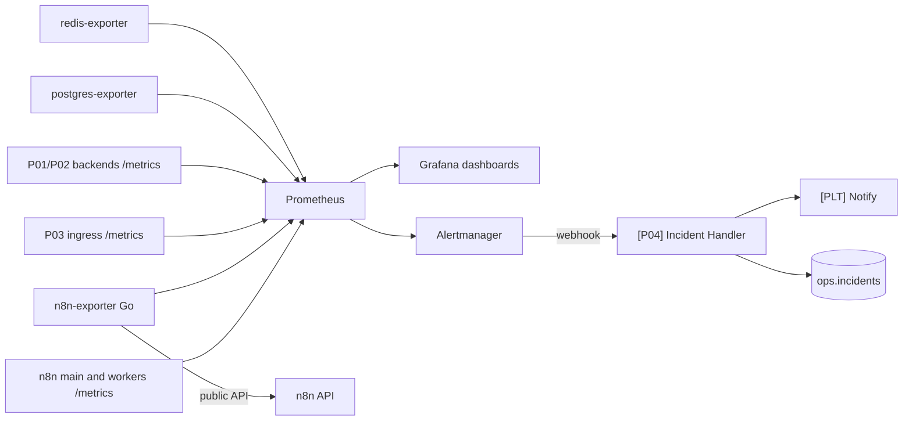

# Spec 04: Monitoring and Self-Healing for n8n (P04)

Folder: `projects/p04-reliability`
Public title: Production Monitoring and Self-Healing Infrastructure for n8n

## 1. Problem (README story)

Automation fails quietly. A token expires, an API starts returning 429, a worker dies, and nobody notices until a customer complains. Teams using n8n often have no metrics, no alerts, no replay, and no record of how their workflows behave under failure.

## 2. Outcome

- Dashboards for the three existing projects: success and failure rates, durations, queue depth, DLQ size, review queue age, inbox lag.
- Alerts with sensible thresholds and a dead man's switch, delivered through an n8n incident workflow with dedupe.
- A shared resilience layer: error classification, backoff, circuit breakers, quarantine, DLQ replay from a UI.
- Scripted chaos scenarios, each run for real, with observed behaviour and measured recovery time written down.

## 3. Scope

In: Prometheus, Grafana, Alertmanager provisioned as code; n8n execution exporter; incident workflow; circuit breaker; DLQ UI; chaos scripts and reports; SLO document.

Out: log aggregation stack (optional stretch: Loki), tracing, paid monitoring services, n8n Enterprise log streaming.

## 4. Architecture

## 5. Components

Monitoring stack (`projects/p04-reliability/docker-compose.yml`)
- Prometheus, Grafana, Alertmanager, postgres-exporter, redis-exporter. Pinned versions.
- Grafana datasources and dashboards provisioned from files in `grafana/`. No clicking in the Grafana UI to create anything that is kept.
- Scrape n8n main and worker metrics. Verify which metrics and endpoints the pinned version exposes (including queue and worker metrics) and document them in `docs/n8n-metrics.md`.

`n8n-exporter` (Go)
- Polls the n8n public API executions endpoint with cursor pagination every 30 s using an API key from `.env`.
- Exposes `n8n_executions_total{workflow,status}`, `n8n_execution_duration_seconds{workflow}` histogram, `n8n_last_success_timestamp_seconds{workflow}`.
- Stores its cursor so restarts do not double count. Unit tests against recorded API response fixtures (sanitized). Handles API errors without crashing and exposes its own `exporter_scrape_errors_total`.
- Only needed for what native metrics do not provide; document the overlap.

Custom metrics from SQL (through postgres-exporter custom queries or a small endpoint in the exporter): DLQ size by status, oldest pending DLQ item age, review queue pending count and oldest age, P03 inbox oldest pending age, LLM tokens per project per hour from the LLM call tables.

Dashboards
- Overview: executions per hour, success rate per workflow, p95 duration, queue depth, active workers, DLQ, review queue, inbox lag, heartbeat age.
- Per project: the business view (P01 leads by route, time to CRM; P02 documents by decision, false-accept candidates in review; P03 events by source and status).
- Dependencies: calls, errors by class, circuit state per dependency.

Alert rules (files, tested with `promtool test rules`)

| Alert | Condition (defaults, tune after real runs) |
|---|---|
| `WorkflowFailureRateHigh` | Failure rate over 5% for 15 min with at least 20 executions |
| `DLQGrowing` | DLQ pending increases for 15 min |
| `InboxLagHigh` | P03 oldest pending age over 5 min |
| `ReviewQueueStale` | Oldest pending review over 24 h |
| `WorkersMissing` | Fewer workers than expected for 5 min |
| `HeartbeatStale` | No heartbeat event for 12 min (dead man's switch) |
| `CircuitOpen` | Any dependency circuit open for 10 min |
| `ExporterDown` | Exporter scrape failing for 5 min |

`[P04] Incident Handler`
- Webhook receiving Alertmanager's webhook format (verify the payload shape for the pinned version).
- Firing: open incident if no open incident has the same fingerprint, otherwise update it; notify once, then at most every 30 min while firing.
- Resolved: close incident, notify with duration.
- Optional: create and close a GitHub issue in a test repository via the GitHub node.

Resilience layer (retrofitted into P01, P02, P03)
- Error classification from the platform taxonomy.
- Short retries in-flow for transient errors (built-in Retry On Fail uses a fixed delay; document the settings used).
- Longer backoff through the DLQ with `next_attempt_at`, handled by `[PLT] DLQ Retrier`. No long Wait nodes.
- Circuit breaker `[PLT] Dependency Guard` (sub-workflow using the Redis node): input `dependency`; state closed, open, half-open in Redis keys with TTL. Opens after 5 consecutive failures within 60 s, half-open probe after 30 s, closes after 2 successes. While open, calls go straight to DLQ with class `circuit_open` and a `next_attempt_at` after the open period.
- Quarantine: `invalid_data` items go to the review queue (kind `quarantine`) with the error.

DLQ UI (added to review-ui)
- List with filters (project, dependency, class, status, age). Detail with redacted payload. Actions: replay, discard with reason, bulk replay by filter with a confirmation step. Every action is audited.

## 6. Chaos scenarios

Scripts in `chaos/`, run with `make chaos SCENARIO=<name>`. Each script records timestamps, triggers the fault, generates load, heals, waits for recovery, and writes a report skeleton to `docs/failure-modes/<name>.md`.

| Scenario | Fault |
|---|---|
| `api-500-burst` | flaky-api returns 500 for 2 minutes during P01 traffic |
| `api-429-storm` | flaky-api returns 429 with `Retry-After: 20` |
| `api-auth-revoked` | flaky-api returns 401 |
| `api-latency` | 10 s latency on CRM calls |
| `worker-kill` | `docker kill` one worker during P02 processing |
| `redis-restart` | Restart Redis during P01 traffic |
| `postgres-restart` | Restart Postgres during P03 traffic |
| `n8n-main-restart` | Restart n8n main during P03 traffic |
| `n8n-down-drain` | Stop all n8n containers for 5 minutes during P03 traffic |

Each report has: setup, command, expected behaviour, observed behaviour (from logs, metrics, database counts), recovery time, data lost (count), duplicates (count), alerts fired, fixes made afterwards. The observed section is filled from the real run. If observed differs from expected, write it down and open a task; do not edit the expectation to match.

## 7. SLO document

`docs/slo.md` with example SLOs, clearly marked as examples for a reference system:
- P01: 99% of valid leads reach the CRM within 5 minutes, measured over 28 days.
- P03: 99.9% of authentic events acknowledged; 99% processed within 2 minutes.
- Error budget explanation and which alerts protect which SLO.

## 8. Tasks

| ID | Task |
|---|---|
| P04-T01 | Monitoring compose with pinned versions and provisioning |
| P04-T02 | Scrape configs; document real n8n metrics in `docs/n8n-metrics.md` |
| P04-T03 | n8n-exporter with fixture tests |
| P04-T04 | SQL-based custom metrics |
| P04-T05 | Dashboards as code |
| P04-T06 | Alert rules with `promtool` tests |
| P04-T07 | `[P04] Incident Handler` with dedupe and e2e test using a fake Alertmanager payload |
| P04-T08 | `[PLT] Dependency Guard` circuit breaker, integrated in P01 CRM Sync, P02 Export, P03 handlers; tests |
| P04-T09 | DLQ UI with audit |
| P04-T10 | Chaos scripts and report generator |
| P04-T11 | Run every scenario, fill reports, fix what broke |
| P04-T12 | SLO document |
| P04-T13 | README (with dashboard screenshots from real runs), ADRs, DoD, tag `p04-v1.0.0` |

## 9. Do and do not (P04)

Do:
- Put a minimum volume on every rate-based alert so one failure at night does not page anyone.
- Show one full incident in the demo video: fault, alert, notification, recovery, resolved message.
- Link each chaos report from the failure-modes section of the affected project's README.

Do not:
- Use high-cardinality labels (lead ids, event ids, emails) in metrics.
- Screenshot dashboards filled with generated fake metrics; use data from real demo runs.
- Build a custom alerting system when Alertmanager plus one n8n workflow does the job.
