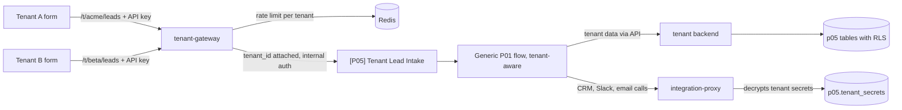

# Spec 05: Multi-Tenant Automation Platform (P05)

Folder: `projects/p05-multi-tenant`
Public title: Multi-Tenant Automation Platform Powered by n8n (reference architecture)

## 1. Problem (README story)

An automation agency runs the same lead-handling process for many clients. Copying workflows per client means N copies to fix, credentials scattered across workflows, one client's traffic slowing others, and no clean way to remove a client's data when the contract ends.

## 2. Outcome

- One set of generic, tenant-aware workflows serves many clients.
- Each tenant has its own configuration, credentials, webhook endpoint, notification channel, quotas, and data, isolated from other tenants and enforced in the database.
- A new tenant is onboarded from a YAML file with one command; the time is measured.
- A tenant can be offboarded with data deletion and an audit record.
- Noisy-neighbour behaviour is tested and the limits are documented.

## 3. Licence note (must appear in README and an ADR)

n8n is distributed under its own licence (Sustainable Use License), not an OSI open-source licence. Running n8n as a hosted service for paying clients may need a separate commercial agreement with n8n. This project is a reference architecture for learning and demonstration. Read the current licence text and link it; do not interpret it for readers beyond that.

## 4. Scope

In: tenant gateway, tenant registry and versioned config, `tenantctl` CLI, encrypted tenant secrets, integration proxy, Postgres row-level security, per-tenant rate limits and quotas, tenant-aware P01 workflows, per-tenant metrics, onboarding and offboarding, noisy-neighbour test.

Out: billing, a tenant self-service UI, SSO. Stretch: Helm chart for the alternative "instance per tenant" model on a local kind cluster.

## 5. Architecture



Decision (ADR): shared n8n instance with tenant-aware workflows as the primary model. Alternative documented: one n8n instance per tenant (strong isolation, more operations work). Compare cost, isolation, upgrade effort, and noisy-neighbour risk.

## 6. Data model (schema `p05`)

`tenants`: `id uuid`, `slug unique`, `name`, `status` (active, disabled, deleted), `created_at`.

`tenant_configs`: `tenant_id`, `version int`, `config jsonb`, `created_at`, `created_by`. Unique `(tenant_id, version)`. The newest version is active. Config changes are never edited in place.

`tenant_api_keys`: `id`, `tenant_id`, `key_hash` (argon2id or SHA-256 with a server-side pepper), `prefix` (first 8 chars for display), `created_at`, `revoked_at`.

`tenant_secrets`: `tenant_id`, `name` (crm_token, slack_webhook, smtp_password), `ciphertext`, `nonce`, `key_version`, `created_at`. AES-256-GCM, master key from env (`TENANT_SECRETS_KEY`), key rotation supported by `key_version`. Production note: replace with a KMS.

Tenant-scoped copies of the P01 tables (`leads`, `submissions`, `email_messages`, `followups`, `suppression_list`, `activities`, `llm_calls`), each with `tenant_id not null`, row-level security enabled, and a policy `tenant_id = current_setting('app.tenant_id')::uuid`. The application role has no `BYPASSRLS`.

## 7. Tenant config (validated by JSON Schema in `config/tenant.schema.json`)

```yaml
slug: acme
name: Acme Robotics Oy (fictional)
languages: [fi, en]
crm:
  provider: mock          # mock | hubspot
notifications:
  channel: email          # email | slack
  target: sales@acme.example
scoring:
  sales_threshold: 75
  nurture_threshold: 45
email:
  from_name: Acme Sales
  from_address: sales@acme.example
  signature: "Acme Robotics Oy"
followups:
  enabled: true
  steps_days: [3, 7]
quotas:
  leads_per_minute: 30
  leads_per_day: 2000
  llm_tokens_per_day: 200000
secrets:                   # names only; values set with tenantctl secret set
  - crm_token
```

## 8. Services

`tenant-gateway` (Go)
- `POST /t/{slug}/leads`: resolve tenant, check status, verify API key (constant time on hash), token-bucket rate limit per tenant in Redis (429 with `Retry-After` beyond it), daily quota, attach `tenant_id`, forward to `[P05] Tenant Lead Intake` with internal auth.
- Metrics per tenant: requests, rejections by reason.

`tenant backend` (FastAPI)
- All tenant data access for n8n goes through this API. Every request carries `tenant_id` from the gateway-signed context; the backend sets `app.tenant_id` on its database session before any query.
- Endpoints mirror the P01 backend (normalize, score with tenant thresholds, lead upsert, follow-up claims) plus `GET /v1/tenants/{id}/config` (non-secret config only).

`integration-proxy` (FastAPI or Go, owner decides in ADR)
- `POST /v1/proxy/{tenant_id}/crm/*`, `/slack`, `/email`. Decrypts the tenant secret in memory, performs the call, returns the result without the secret.
- n8n never sees tenant secrets, so execution data never contains them.

`tenantctl` (Go CLI)
- `validate -f tenants/acme.yaml`, `diff -f`, `apply -f` (new config version, audit), `list`, `key create|revoke`, `secret set <name>` (reads value from stdin, never from arguments), `disable`, `delete --confirm acme` (offboarding).

## 9. Workflows

- `[P05] Tenant Lead Intake`, `[P05] Tenant Qualify Lead`, `[P05] Tenant CRM Sync`, `[P05] Tenant Sales Path`, `[P05] Tenant Follow-up Scheduler`, `[P05] Tenant Offboarding`.
- They are the P01 workflows made generic: tenant config is fetched once per execution from the backend, every external call goes through the integration proxy, every data call goes through the tenant backend. No direct SQL from n8n to tenant tables.
- The follow-up scheduler processes tenants fairly: round-robin batches per tenant, not one global oldest-first query that one big tenant can dominate.

## 10. Failure modes and edge cases

| ID | Scenario | Expected behaviour | Test |
|---|---|---|---|
| F01 | Tenant A key used on tenant B path | 401 | `test_cross_tenant_key` |
| F02 | Query without tenant context | Zero rows (RLS), error logged | `test_rls_no_context` |
| F03 | Tenant A context reading B's lead id | Zero rows | `test_rls_cross_read` |
| F04 | Tenant A floods 2000 leads in a minute | A gets 429 beyond quota; B's p95 intake latency stays within the documented limit | `test_noisy_neighbour` (k6) |
| F05 | Tenant's CRM token invalid | Only that tenant's circuit opens; others unaffected | `test_tenant_circuit_isolation` |
| F06 | Invalid tenant YAML | `tenantctl validate` fails with a clear message; nothing applied | `test_invalid_config` |
| F07 | Config change mid-traffic | New executions use the new version; each execution records the version it used | `test_config_version_switch` |
| F08 | Disabled tenant | 403 at gateway; scheduled follow-ups for that tenant paused | `test_disabled_tenant` |
| F09 | Offboarding | Tenant data deleted, secrets deleted, keys revoked, audit record kept without personal data | `test_offboarding` |
| F10 | Secrets in execution data | A test scans exported execution data for known test secret values and finds none | `test_no_secret_leak` |
| F11 | Master key rotation | Old secrets readable, re-encrypted with new key version | `test_key_rotation` |

## 11. Measurements

- Onboarding time from `tenantctl apply` to first processed lead (median of 5 runs).
- Noisy-neighbour results: tenant B p95 with and without tenant A flooding.
- Per-tenant throughput limit on the test hardware.

## 12. Tasks

| ID | Task |
|---|---|
| P05-T01 | ADRs: shared instance vs instance per tenant, licence note, proxy language |
| P05-T02 | Migrations with RLS and role setup; RLS tests first |
| P05-T03 | Tenant config schema, versioning, `tenantctl validate|diff|apply|list` |
| P05-T04 | API keys and secrets (encryption, rotation), `tenantctl key` and `secret` |
| P05-T05 | tenant-gateway with rate limits and quotas |
| P05-T06 | Tenant backend with session-level tenant context |
| P05-T07 | Integration proxy |
| P05-T08 | Tenant-aware workflows |
| P05-T09 | Fair follow-up scheduler |
| P05-T10 | Per-tenant metrics and Grafana tenant variable (P04 stack) |
| P05-T11 | Offboarding workflow and `tenantctl delete` |
| P05-T12 | e2e for F01 to F11, k6 noisy-neighbour scenario, measurements |
| P05-T13 | Stretch: Helm chart for instance-per-tenant on kind, documented comparison |
| P05-T14 | README, diagrams, ADRs, failure modes, DoD, tag `p05-v1.0.0` |

## 13. Do and do not (P05)

Do:
- Write the RLS tests before the tables are used by any service.
- Show onboarding of a new tenant live in the demo video.
- Keep tenant metrics labels bounded (tenant slug is fine for tens of tenants; say where that stops working).

Do not:
- Copy workflows per tenant.
- Store tenant secrets in n8n credentials or pass them through nodes.
- Let n8n query tenant tables directly.
- Present this as a product others can buy hosted access to.
