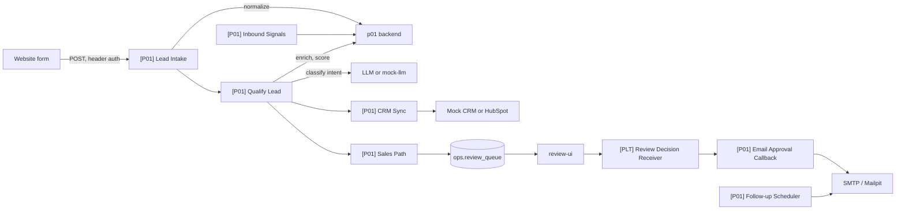

# Production AI Lead Qualification and Sales Automation with n8n

Inbound form leads are normalized, scored with a documented rules engine, routed, and prepared for CRM sync and a human-approved first email. n8n will orchestrate; this FastAPI backend computes.

Status: reference implementation with synthetic data. Version: not tagged. Backend unit tests exist. n8n workflow JSON is not in this folder.

Demo video: not recorded yet.

## The problem

A B2B services company receives inbound leads from its website form. Sales answers slowly, spends time on spam, students, and job seekers, and good leads get a generic reply days later. The same person submits twice and gets two emails. When the CRM API is down, leads disappear.

## What it does

A form POSTs to `[P01] Lead Intake` (specified, not imported yet). The backend trims and lowercases email, flags free-mail and disposable domains, and scores the lead from `backend/config/scoring.yaml`. The LLM may add at most 20 of 100 points and does not pick the route. High-scoring leads get a draft email that waits in `ops.review_queue`. Follow-ups stop on reply, booking, bounce, or unsubscribe.

Today you can call `/v1/leads/normalize` and `/v1/score` with `INTERNAL_API_TOKEN`. Intake webhooks, CRM, SMTP, and review callbacks wait for pinned n8n.

## Architecture



The backend owns normalize and score (unit-tested). n8n will own triggers, routing, human review, and notifications. See [docs/adr/0002-n8n-orchestrates-backends-compute.md](../../docs/adr/0002-n8n-orchestrates-backends-compute.md).

## Why n8n, and where n8n is not used

n8n orchestrates intake, qualify, CRM, sales path, follow-ups, and inbound signals. The FastAPI service does normalization, scoring, and (later) email-draft checks because those need table-driven tests and must not live as untested Code nodes. Secrets stay in credentials or the backend, not in node output.

## Workflows

Specs only. See [docs/workflows.md](docs/workflows.md). JSON is committed only after import into `n8nio/n8n:2.37.9`, publish, and e2e.

| Workflow | Trigger | Responsibility |
|---|---|---|
| `[P01] Lead Intake` | Webhook POST | Validate, normalize, dedupe, store, respond |
| `[P01] Qualify Lead` | Sub-workflow | Enrich, classify, score, route |
| `[P01] CRM Sync` | Sub-workflow | Upsert contact and company |
| `[P01] Sales Path` | Sub-workflow | Notify sales, draft email, enqueue review |
| `[P01] Email Approval Callback` | Sub-workflow | Send approved email, schedule follow-ups |
| `[P01] Nurture Path` | Sub-workflow | Templated email only with consent |
| `[P01] Follow-up Scheduler` | Schedule, every 10 min | Due follow-ups inside quiet hours |
| `[P01] Inbound Signals` | Webhook | Reply, booking, bounce |
| `[P01] Reconcile` | Schedule, hourly | Re-run stuck leads |

Canvas screenshot: not taken yet.

## Run it in 5 minutes

Needs Docker and GNU Make. Copy `.env.example` to `.env` first.

```bash
git clone https://github.com/Aliipou/n8n-production-systems
cd n8n-production-systems
cp .env.example .env
make up P=p01
```

After a successful start:

- n8n: http://127.0.0.1:5678
- P01 backend: http://127.0.0.1:8101
- Mailpit: http://127.0.0.1:8025
- review-ui: http://127.0.0.1:8092

One-time n8n owner setup: [platform/README.md](../../platform/README.md). `make demo P=p01` is not implemented.

Backend unit tests without Docker (from `projects/p01-lead-qualification/backend`):

```bash
python -m pytest -q
```

## Failure modes

| Scenario | What happens | Evidence |
|---|---|---|
| Score and route from yaml | Deterministic score, LLM cap 20 | [backend/tests/test_score.py](backend/tests/test_score.py) |
| Finnish/Swedish names, +358, free-mail | Normalized fields | [backend/tests/test_normalize.py](backend/tests/test_normalize.py) |
| Missing internal token | 401 | [backend/tests/test_api.py](backend/tests/test_api.py) |
| Concurrent duplicate intake | One lead (planned) | e2e not written; see [docs/failure-modes.md](docs/failure-modes.md) F01 |

A row in `docs/failure-modes.md` is not handled until the named test exists and passes.

## Observability

Structured JSON logs from the backend. Workflow events go to `ops.execution_log` once those workflows exist. Dashboards are P04. Not measured yet.

## Security

- `/v1/leads/normalize` and `/v1/score` require `INTERNAL_API_TOKEN` (constant-time compare).
- `/health` is unauthenticated.
- Host port binds to `127.0.0.1:8101`.
- No real personal data. Fixtures use Faker locales in later generator scripts.
- Designed with GDPR considerations (suppression list, retention). Not legal advice.

## Deployment

Intended shape: queue-mode n8n, Postgres database `app` schema `p01`, this backend on the compose network. What was actually tested: pytest on the backend. Compose start is unproven on the Windows workspace that wrote this file (no Docker).

## Results

Not measured yet. No intake latency, score accuracy, or email send rate.

## Cost

Not measured yet. No live LLM calls in the current normalize/score code. The LLM contribution to score is capped at 20 of 100 points when wired.

## Limitations

- n8n workflows are not imported. `make demo` does not exist.
- Mock CRM, enrichment, email-draft check, unsubscribe page, and follow-up tables are specified; not all are in the FastAPI app yet.
- HubSpot is not claimed as tested until a real test-mode API call exists.
- Quiet hours, owner email, and CRM provider must come from `p01.settings`, not from nodes.

## Decisions

Platform ADRs that apply:

- [0002 n8n orchestrates, backends compute](../../docs/adr/0002-n8n-orchestrates-backends-compute.md)
- [0004 durable scheduling instead of long waits](../../docs/adr/0004-durable-scheduling-instead-of-long-waits.md)
- [0005 error taxonomy](../../docs/adr/0005-error-taxonomy.md)

Project ADRs: none yet.

## License

MIT for code in this repository. n8n is not included and is licensed separately by n8n GmbH.
