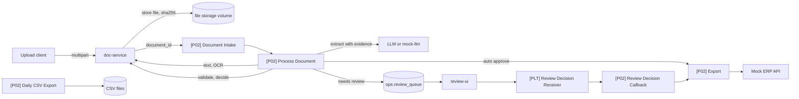

# P02 Human-in-the-Loop Invoice Processing

Personal portfolio project (reference implementation, synthetic data only). Not client work. Not a production deployment.

n8n orchestrates intake, processing, review callbacks, export, and scheduled jobs. This FastAPI doc-service stores files, dedupes by sha256, and runs deterministic validators. Files never pass through n8n; n8n carries `document_id` only.

Status: not runnable until the platform compose stack exists (`platform/compose/docker-compose.base.yml`, PLT-T03) and `make up P=p02-document-intelligence` can start it. OCR, LLM extraction, and evaluation are later tasks.

Results: not measured yet.

Most Finnish B2B invoices already arrive as e-invoices (Finvoice, Peppol). This pipeline targets the PDF and scanned remainder. E-invoice XML is out of scope.

## The problem

A small accounting office receives supplier invoices as PDFs, some text-based and some scanned, in Finnish and English. Staff type the fields into the accounting system by hand. Errors happen, the same invoice is sometimes entered twice, and a changed bank account number on a fake invoice is easy to miss.

## What it does

An upload client posts a PDF, PNG, or JPEG (max 10 MB). Magic bytes decide the type. The service stores the bytes on a volume, records a row in schema `p02`, and returns the same `document_id` if the sha256 already exists. n8n is told the id only. Validators check Finnish Y-tunnus, IBAN, Finnish or RF reference, VAT arithmetic, and dates. Auto-approve happens only when every gate in `backend/config/decision.yaml` passes. Everything else goes to a reviewer.

## Architecture



doc-service owns files, checksums, and validators. n8n owns routing, retries, review, and export. Thresholds live in config files, not in workflow nodes.

## Why n8n, and where n8n is not used

n8n triggers on the intake webhook, calls Process, routes to review or export, and runs daily CSV, reconcile, and retention. The backend does upload, magic-byte type checks, sha256 dedupe, storage, and validators because those need unit tests and must not depend on node parameters. Binary files are not passed through n8n nodes.

## Workflows

Specs only. Workflow JSON is not in this folder (AGENTS.md section 5). See [docs/workflows.md](docs/workflows.md).

| Workflow | Trigger | Responsibility |
|---|---|---|
| `[P02] Document Intake` | Webhook from doc-service | Idempotency on `document_id`, set processing, call Process |
| `[P02] Process Document` | Sub-workflow | Text, classify, extract, validate, decide, route |
| `[P02] Review Decision Callback` | Sub-workflow (from review receiver) | Apply corrections, audit, export |
| `[P02] Export` | Sub-workflow | Mock ERP create, idempotent |
| `[P02] Daily CSV Export` | Schedule, daily 06:00 | CSV of invoices approved the previous day |
| `[P02] Reconcile` | Schedule, every 15 min | Requeue documents stuck in `processing` over 10 minutes |
| `[P02] Retention Purge` | Schedule, daily | Delete files and text past retention, keep audit |

## Run it in 5 minutes

```bash
git clone https://github.com/Aliipou/n8n-production-systems
cd n8n-production-systems
cp .env.example .env
make up P=p02-document-intelligence
make demo P=p02-document-intelligence
```

`make up` and `make demo` are not available until the platform compose stack and the P02 demo script exist. One-time n8n owner setup is in `platform/README.md`. Bind addresses stay on `127.0.0.1`. After the stack exists, doc-service is `http://127.0.0.1:8102`.

## Synthetic data

Do not commit or use real invoices, even redacted. Supplier rows in `db/migrations/20260911140001_p02_suppliers_seed.sql` are invented companies with invented IBANs. Upload tests use tiny PDF, PNG, and JPEG headers, not invoice layouts. The invoice generator (`scripts/generate_invoices.py`) is a later task and will use Faker `fi_FI` / `en_US` with a fixed seed. Only a small generated sample will be committed; the full set is produced by the script.

## Failure modes

From `docs/specs/02-document-intelligence.md`. A row is not handled until the named test exists and passes. Upload and validator coverage is in `backend/tests/`.

| Scenario | What happens | Evidence |
|---|---|---|
| Same file uploaded twice | Same `document_id`, no second intake webhook | `backend/tests/test_upload.py` `test_same_file_dedupe` |
| PDF extension, other content | 415 | `backend/tests/test_upload.py` `test_magic_bytes_pdf_extension_other_content` |
| Over 10 MB | 413 | `backend/tests/test_upload.py` `test_file_too_large` |
| Invalid Y-tunnus / IBAN / reference / dates / VAT math | Validator `passed=false` | `backend/tests/test_*.py` table tests |
| Same invoice, different scan | Duplicate invoice rule, review (not implemented yet) | `test_duplicate_invoice` |
| Encrypted PDF | `needs_manual` (not implemented yet) | `test_encrypted_pdf` |
| IBAN differs from registry | Always review (not implemented yet) | `test_iban_change` |

## Observability

Structured JSON logs from doc-service (`level`, `logger`, `msg`). Workflow events go to `ops.execution_log` once those workflows exist. Metrics and dashboards are P04. Not measured yet.

## Security

- `POST /v1/documents`, `GET /v1/documents/{id}/file`, and `POST /v1/extractions/validate` require header `INTERNAL_API_TOKEN` (constant-time compare).
- `/health` is unauthenticated.
- Host port binds to `127.0.0.1:8102`.
- Schema `p02` grants follow platform roles (`app_backend`, `n8n_app`, `readonly`).
- File retention purge is a later workflow. Do not put real invoices in the volume.

## Deployment

Not tested outside this laptop layout. Planned shape: queue-mode n8n, Postgres `app` database, doc-service replica with a shared files volume, Tesseract `fin+eng` in the image (later task). Minimum resources: not measured yet.

## Results

Not measured yet. Field accuracy, straight-through rate, and false-accept rate will come from `make eval P=p02` after the evaluation harness exists. That run is never in CI.

## Cost

Not measured yet. No LLM calls in the current upload and validator code.

## Limitations

- VAT rates in `backend/config/vat_rates.yaml` are empty on purpose. Fill them from vero.fi (`TODO(verify)`). Until then the `vat_rates` rule fails closed.
- Text extraction, OCR, classification, LLM extraction, supplier registry checks, duplicate-invoice detection, mock ERP, review UI template, and evaluation are not built yet.
- Auto-approve is not wired. Decision thresholds are in config only.
- E-invoice XML (Finvoice, Peppol) is out of scope.
- Fixtures are synthetic. Company names must not match real companies.

## Decisions

Project ADRs will land under `docs/adr/` in later tasks (confidence formula is P02-T08). None yet.

## License

MIT for code in this repository. n8n is not included and is licensed separately by n8n GmbH.
