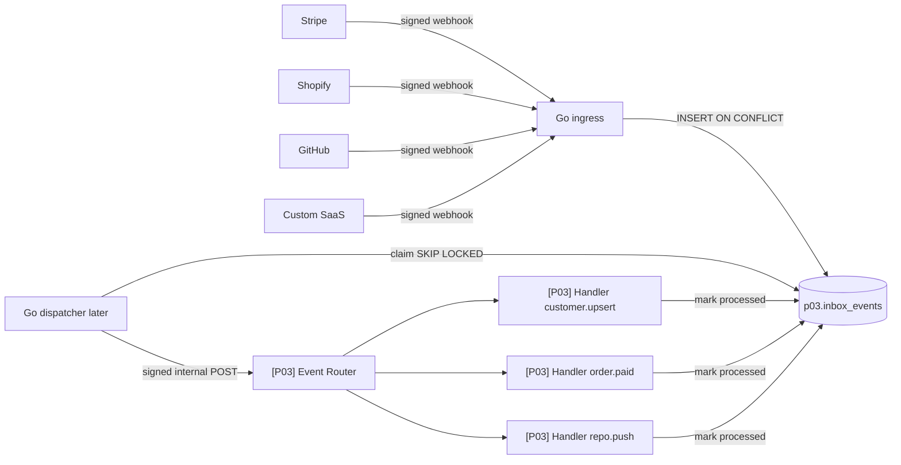
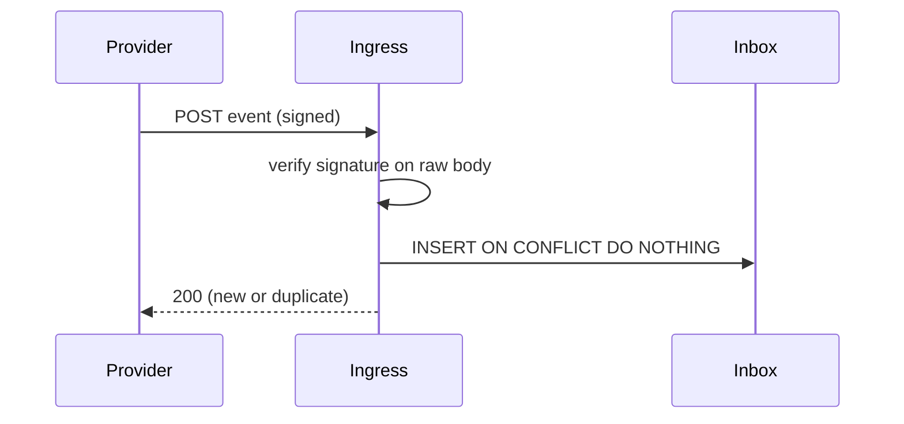

# Event-Driven Webhook Integration Platform

A Go ingress verifies provider signatures on the raw body and stores each event before it returns 2xx. n8n will route and run idempotent handlers. Delivery to processing is at-least-once with idempotent handlers, not exactly-once.

Status: reference implementation with synthetic data. Ingress and schema `p03` are in this folder. n8n workflows are specified in `docs/workflows.md` and are not committed as JSON yet. Version: not tagged.

Demo video: not recorded yet.

## The problem

Webhooks from Stripe, Shopify, GitHub, and an internal SaaS arrive while the automation server is restarting. Events are lost. Providers retry and the same order is fulfilled twice. Updates arrive out of order and overwrite newer customer state. After a handler bug is fixed, there is no safe way to replay the failed events.

## What it does

A provider POSTs a signed event to `POST /hooks/{stripe|shopify|github|custom}`. The Go ingress reads at most 1 MB of the raw body, checks the signature, and inserts into `p03.inbox_events` with `ON CONFLICT (source, external_event_id) DO NOTHING`. New and duplicate events both get HTTP 200 only after that insert attempt. A later dispatcher (not in this slice) claims pending rows and POSTs them to the n8n router. Handlers claim an effect key before side effects, so a second delivery does not send a second email or create a second fulfilment.

## Architecture





The ingress is small on purpose. It authenticates, limits size, and records the event. It does not normalize types or call CRMs. See `docs/adr/0001-inbox-pattern.md` and `docs/adr/0002-ingress-outside-n8n.md`.

## Why n8n, and where n8n is not used

n8n will orchestrate routing, mock CRM sync, fulfilment records, and notifications once the workflow specs in `docs/workflows.md` are built in the pinned editor. The Go ingress owns cryptography, the 1 MB cap, and durable acknowledgement. Signature checks need the raw body and constant-time compare, which are tested in Go. State lives in Postgres schema `p03`, not in n8n static data.

## Workflows

Outlined in `docs/workflows.md`. No workflow JSON is in this folder yet. Build them in running n8n, then import, publish, export, sanitize, and lint.

| Workflow | Trigger | Responsibility |
|---|---|---|
| `[P03] Event Router` | Webhook from dispatcher | Verify internal signature, normalize, route, 200 |
| `[P03] Handler customer.upsert` | Sub-workflow | Upsert only if `source_ts` is newer |
| `[P03] Handler order.paid` | Sub-workflow | Create fulfilment once; notify |
| `[P03] Handler repo.push` | Sub-workflow | Record push; notify |
| `[P03] Handler unknown` | Sub-workflow | Mark `ignored` |
| `[P03] Retention Purge` | Daily schedule | Null payloads older than 30 days |

Canvas screenshot: not taken yet (workflows not imported).

## Run it in 5 minutes

Platform compose is in `platform/compose/docker-compose.base.yml`. After Docker is installed:

```bash
git clone https://github.com/Aliipou/n8n-production-systems
cd n8n-production-systems
cp .env.example .env
# also copy projects/p03-webhook-gateway/.env.example secrets into .env
make up P=p03
make demo P=p03
```

Ingress URL (planned): `http://127.0.0.1:8103`. One-time n8n owner setup is in `platform/README.md`.

Unit tests (no Postgres): from this folder, `go test ./ingress`. They use `MemoryStore` and `FakeSQLStore`, which apply the same `INSERT ON CONFLICT DO NOTHING` rule as the SQL in `db/migrations/`.

## Failure modes

| Scenario | What happens | Evidence |
|---|---|---|
| Provider retries the same event | 200, one inbox row | `TestHookDuplicateOnConflict`, `TestStoreOnConflictDoNothing` |
| 50 concurrent duplicates | One row | `TestConcurrentDuplicates`, `TestMemoryStoreConcurrentDuplicates` |
| Bad signature | 401, nothing stored | `TestHooksTable/github_bad_signature` and the other `*_bad_signature` cases |
| Timestamp outside 5 minutes | 401 | `TestHooksTable/stripe_timestamp_outside_5min`, `TestHooksTable/custom_stale_timestamp` |
| Body over 1 MB | 413, nothing stored | `TestHooksTable/oversize_body` |
| Unknown source | 404 | `TestHooksTable/unknown_source` |
| Inbox insert error | 503 so the provider retries | `TestStoreErrorReturns503` |

Dispatcher, n8n-down drain, replay, and multi-replica cases are specified in `docs/specs/03-webhook-gateway.md` and are not implemented in this slice.

## Observability

JSON logs on the ingress: `source`, `event_id`, `event_type`, `result` (`new` or `duplicate`). Full payloads are not logged. Prometheus gauges (`inbox_pending`, oldest pending age) wait for the dispatcher slice. `/healthz` is implemented.

## Security

Every public `POST /hooks/{source}` checks a per-source HMAC on the raw body (constant-time compare). GitHub uses `X-Hub-Signature-256`. Stripe uses `Stripe-Signature` with HMAC plus timestamp (see TODO(verify) pointing at stripe-go). Shopify uses base64 HMAC in `X-Shopify-Hmac-Sha256`. Custom signs `timestamp.body` with a 5 minute skew. Failed signatures are not stored. Secrets come from environment variables, never from n8n node output. Payload retention is 30 days (purge workflow not built). This is not a claim of legal compliance.

## Deployment

Intended shape: ingress container bound to `127.0.0.1:8103`, Postgres `app` database with schema `p03`, n8n queue mode for handlers. What was actually tested: Go unit tests against the fake store. Compose, load, and a real Stripe CLI path are not measured yet. See `docs/deployment.md`.

## Results

Not measured yet. No k6 run, no drain-time, no hardware numbers.

## Cost

No LLM in this project. Infrastructure cost: not measured yet.

## Limitations

- Delivery is at-least-once. After a crash mid-handler the event can be delivered again. Idempotent effect keys are how duplicates stay harmless. Do not describe this as exactly-once.
- The ingress binary in `cmd/ingress` uses the in-memory store so tests and laptops without Postgres can exercise HTTP. Production must use `SQLStore` plus `InsertInboxSQL` against Postgres. The migration is ready; the pgx wire-up is not.
- n8n workflows, dispatcher, `gatewayctl`, `sim`, and k6 are not in this slice.
- Stripe verification is a local HMAC+timestamp check with `TODO(verify)` to switch to stripe-go `webhook.ConstructEvent`.
- Provider names in a public resume wait for a real test-mode delivery. Fixtures here are synthetic.

## Decisions

- `docs/adr/0001-inbox-pattern.md`
- `docs/adr/0002-ingress-outside-n8n.md`
- `docs/adr/0003-at-least-once.md`

## License

MIT for code in this repository. n8n is not included and is licensed separately by n8n GmbH.
