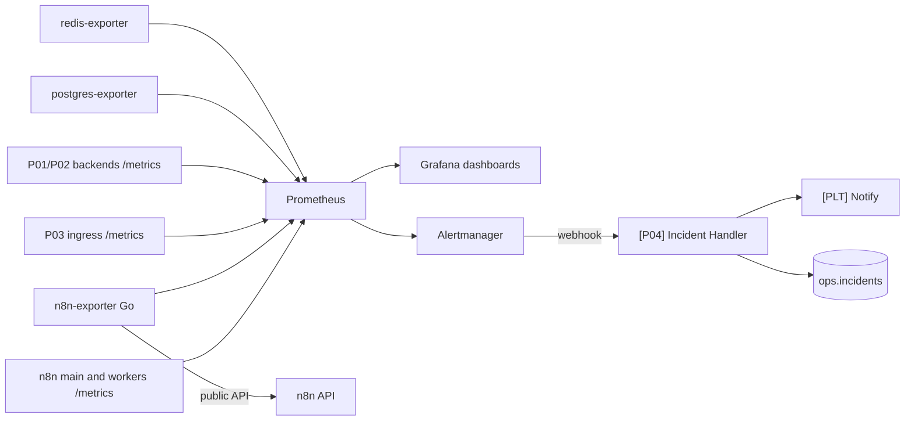

# Production Monitoring and Self-Healing Infrastructure for n8n

Prometheus, Grafana, and Alertmanager watch the n8n queue-mode stack and the
P01 to P03 services. Alerts go to an n8n incident workflow. Chaos scripts
(not written yet) record what happens when a dependency or process fails.

Status: compose and Grafana provisioning skeleton. Not a complete P04
release. Version: not tagged (`p04-v1.0.0` is P04-T13). Reference
implementation with synthetic data when demos exist.

Demo video: not recorded yet.

## The problem

Automation fails quietly. A token expires, an API starts returning 429, or
a worker dies, and nobody notices until a customer complains. Teams using
n8n often have no metrics, no alerts, no replay, and no record of how
workflows behave under failure.

## What it does

When the stack is complete, Prometheus scrapes n8n, exporters, and project
backends. Grafana loads dashboards from files in `grafana/`. Alertmanager
posts to `[P04] Incident Handler`, which opens or updates a row in
`ops.incidents` and notifies through `[PLT] Notify`. Chaos scenarios in
`chaos/` inject faults and write reports under `docs/failure-modes/`.

This folder currently ships the monitoring compose skeleton, Grafana
provisioning folders, a chaos name list, and example SLO text. Exporter
code, dashboards from real runs, alert PromQL, the incident workflow, the
circuit breaker, and chaos scripts are later tasks (P04-T02 to P04-T11).

## Architecture



Prometheus is the scrape and rule engine. Grafana is file-provisioned.
Alertmanager is the notifier. The incident workflow and `n8n-exporter` are
not in this skeleton.

## Why n8n, and where n8n is not used

n8n will own the incident webhook, dedupe against `ops.incidents`, and
notifications (`[P04] Incident Handler`, `[PLT] Notify`). It will also
run `[PLT] Dependency Guard` and DLQ retry once those platform workflows
exist.

Prometheus, Grafana, Alertmanager, postgres-exporter, redis-exporter, and
the planned Go `n8n-exporter` are not n8n. Metrics storage, PromQL, and
dashboard provisioning stay outside n8n so they can be tested with
`promtool` and started from compose. See
[docs/adr/0002-n8n-orchestrates-backends-compute.md](../../docs/adr/0002-n8n-orchestrates-backends-compute.md).

## Workflows

| Workflow | Trigger | Responsibility |
|---|---|---|
| `[P04] Incident Handler` | Alertmanager webhook (not built, P04-T07) | Open or update `ops.incidents` by fingerprint; notify on fire and resolve |
| `[PLT] Dependency Guard` | Called by other workflows (not built, P04-T08) | Circuit breaker state in Redis |
| `[PLT] Notify` | Called by the incident handler (platform) | Deliver the notification |

No workflow JSON is in this folder. Workflows are built in the pinned n8n
editor and exported after a passing import (AGENTS.md section 5).

Canvas screenshot: not taken yet (workflow does not exist).

## Run it in 5 minutes

```bash
git clone https://github.com/Aliipou/n8n-production-systems
cd n8n-production-systems
cp .env.example .env
make up P=p04-reliability
```

Needs the platform compose stack (`platform/compose/docker-compose.base.yml`)
and a filled `.env`. One-time n8n owner account and API key: see
`platform/README.md` when that note exists.

URLs after a successful `make up P=p04-reliability` (bind `127.0.0.1` only):

- n8n: http://127.0.0.1:5678
- Grafana: http://127.0.0.1:3000 (admin password from `GRAFANA_ADMIN_PASSWORD`, default `change-me`)
- Prometheus: http://127.0.0.1:9090
- Alertmanager: http://127.0.0.1:9093
- Mailpit: http://127.0.0.1:8025
- review-ui: http://127.0.0.1:8092

`make demo P=p04-reliability` is not implemented. Grafana has no dashboard
JSON yet (see `grafana/dashboards/README.md`).

## Failure modes

| Scenario | What happens | Evidence |
|---|---|---|
| `api-500-burst` | flaky-api returns 500 for 2 minutes during P01 traffic | [chaos/README.md](chaos/README.md) (script not written) |
| `api-429-storm` | flaky-api returns 429 with `Retry-After: 20` | [chaos/README.md](chaos/README.md) (script not written) |
| `api-auth-revoked` | flaky-api returns 401 | [chaos/README.md](chaos/README.md) (script not written) |
| `api-latency` | 10 s latency on CRM calls | [chaos/README.md](chaos/README.md) (script not written) |
| `worker-kill` | `docker kill` one worker during P02 processing | [chaos/README.md](chaos/README.md) (script not written) |
| `redis-restart` | Restart Redis during P01 traffic | [chaos/README.md](chaos/README.md) (script not written) |
| `postgres-restart` | Restart Postgres during P03 traffic | [chaos/README.md](chaos/README.md) (script not written) |
| `n8n-main-restart` | Restart n8n main during P03 traffic | [chaos/README.md](chaos/README.md) (script not written) |
| `n8n-down-drain` | Stop all n8n containers for 5 minutes during P03 traffic | [chaos/README.md](chaos/README.md) (script not written) |

A row is not handled until the chaos script exists, has been run, and the
report's observed section is filled from that run. Walkthrough with
screenshots: not recorded yet.

## Observability

- Prometheus scrape config: `prometheus/prometheus.yml` (self, Grafana,
  Alertmanager, postgres-exporter, redis-exporter). n8n scrape jobs are
  commented until P04-T02 documents real endpoints.
- Grafana datasource: `grafana/provisioning/datasources/prometheus.yml`.
- Dashboards: provisioned from `grafana/dashboards/` which is empty of JSON
  until a real run (no generated fake metrics).
- Alert rules: `prometheus/alerts.yml` is an empty group listing planned
  names. PromQL lands in P04-T06 with `promtool` tests.
- Example SLO text: [docs/slo.md](docs/slo.md). Marked as examples, not
  measured results.
- Native n8n metric names: not documented yet (`docs/n8n-metrics.md` is
  P04-T02).

## Security

- Compose binds Grafana, Prometheus, Alertmanager, and exporters to
  `127.0.0.1` only.
- Grafana sign-up is off. Anonymous auth is off. Admin password is the
  local placeholder unless `GRAFANA_ADMIN_PASSWORD` is set in `.env`.
- Alertmanager webhook URL is a placeholder to n8n on the compose network.
- The planned `n8n-exporter` will read `N8N_API_KEY` from `.env`, not from
  workflow JSON.
- This skeleton does not add TLS or authentication in front of Prometheus.
  That is a gap for any use beyond a laptop.

## Deployment

Outside a laptop this would run next to the same n8n queue-mode stack:
pinned image tags, file-provisioned Grafana, Prometheus retention sized
for the host disk, Alertmanager sending to n8n (or a real on-call tool).
Minimum resources, backup of Grafana and Prometheus volumes, and upgrade
steps are not tested. What was actually tested: nothing in this skeleton
has been started on this machine as part of this draft.

## Results

Not measured yet. No latency, recovery time, or traffic figure belongs in
this README until a script in the repo produces it.

## Cost

Not measured yet. No LLM usage in P04 itself. Infrastructure cost for a
hosted Prometheus/Grafana pair is not estimated here.

## Limitations

- Image tags are pinned to GitHub releases dated 2026-09-11 and marked
  `TODO(verify)` until Docker Hub tags and healthcheck binaries are
  confirmed.
- Dashboards, PromQL, `n8n-exporter`, incident workflow, circuit breaker,
  DLQ UI, and chaos scripts are not in this folder yet.
- Example SLO percentages in `docs/slo.md` are not results.
- Log aggregation (Loki) and tracing are out of scope.
- Community Edition only: no n8n Enterprise log streaming.

## Decisions

Project ADRs are not written yet. Platform decisions that apply:

- [0002 n8n orchestrates, backends compute](../../docs/adr/0002-n8n-orchestrates-backends-compute.md)
- [0003 Community Edition only](../../docs/adr/0003-community-edition-only.md)

## License

MIT for code in this repository. n8n is not included and is licensed
separately by n8n GmbH.
