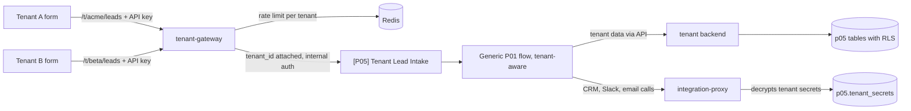

# Multi-Tenant Automation Platform Powered by n8n (reference architecture)

One set of tenant-aware n8n workflows serves many clients. Each tenant has
its own config, secrets, webhook path, quotas, and Postgres rows isolated
by row-level security. n8n never holds tenant secrets and never queries
tenant tables.

**Licence note.** n8n is distributed under its own licence (Sustainable
Use License), not an OSI open-source licence. Running n8n as a hosted
service for paying clients may need a separate commercial agreement with
n8n. This project is a reference architecture for learning and
demonstration. It is not a hosted product and is not an offer to run n8n
as a service for paying clients. Read the current licence text:

https://docs.n8n.io/sustainable-use-license/

TODO(verify): confirm that URL for the pinned n8n version.

Status: schema, RLS tests, tenant YAML example, and ADR draft. Services
and workflows are not built. Version: not tagged (`p05-v1.0.0` is
P05-T14). Reference implementation with synthetic data. The example
tenant Acme Robotics Oy is fictional.

Demo video: not recorded yet.

## The problem

An automation agency runs the same lead-handling process for many
clients. Copying workflows per client means N copies to fix, credentials
scattered across workflows, one client's traffic slowing others, and no
clean way to remove a client's data when the contract ends.

## What it does

When complete: a form posts to `tenant-gateway` at `/t/{slug}/leads` with
an API key. The gateway checks status, key, rate limit, and daily quota,
attaches `tenant_id`, and forwards to `[P05] Tenant Lead Intake`. The
generic P01-style flow loads that tenant's config from the tenant
backend, writes leads through the same API (session GUC `app.tenant_id`
plus RLS), and calls CRM, Slack, or email through `integration-proxy`,
which decrypts secrets in memory. `tenantctl apply -f tenants/acme.yaml`
onboards a tenant. `tenantctl delete --confirm acme` offboards.

This folder currently has the shared-instance ADR, JSON Schema, a
fictional Acme YAML, SQL migrations with RLS, and RLS tests. Gateway,
backend, proxy, CLI, and workflows are later tasks.

## Architecture



The gateway is the only public entry. n8n orchestrates. The backend sets
`app.tenant_id` before every query. The proxy is the only process that
decrypts tenant secrets. See
[docs/adr/0001-shared-instance.md](docs/adr/0001-shared-instance.md).

## Why n8n, and where n8n is not used

n8n orchestrates the generic tenant flow: intake, qualify, CRM sync,
sales path, follow-up scheduler, offboarding. It does not store tenant
secrets, does not talk to `p05` tables, and does not copy workflows per
tenant.

The tenant backend (FastAPI, not written) owns scoring with tenant
thresholds, upserts, and session-level tenant context. `tenant-gateway`
and `tenantctl` (Go, not written) own HTTP entry, keys, and YAML apply.
`integration-proxy` decrypts secrets and calls vendors. Postgres RLS is
the database backstop. That split follows
[0002](../../docs/adr/0002-n8n-orchestrates-backends-compute.md).

## Workflows

| Workflow | Trigger | Responsibility |
|---|---|---|
| `[P05] Tenant Lead Intake` | Gateway (not built) | Accept a tenant-scoped lead |
| `[P05] Tenant Qualify Lead` | Called after intake (not built) | Enrich, score, route using tenant config |
| `[P05] Tenant CRM Sync` | Called after qualify (not built) | CRM upsert via integration-proxy |
| `[P05] Tenant Sales Path` | Called after qualify (not built) | First email review path |
| `[P05] Tenant Follow-up Scheduler` | Schedule (not built) | Fair per-tenant batches, not global oldest-first |
| `[P05] Tenant Offboarding` | `tenantctl delete` (not built) | Delete data and secrets, revoke keys, keep audit without personal data |

No workflow JSON is in this folder. Workflows are built in the pinned n8n
editor and exported after a passing import (AGENTS.md section 5).

Canvas screenshot: not taken yet.

## Run it in 5 minutes

```bash
git clone https://github.com/Aliipou/n8n-production-systems
cd n8n-production-systems
cp .env.example .env
make up P=p05-multi-tenant
```

`make up P=p05-multi-tenant` needs `projects/p05-multi-tenant/docker-compose.yml`,
which is not in this draft. Platform compose plus P05 migrations are not
wired yet. `make demo` is not implemented.

Example tenant file (fictional): [tenants/acme.yaml](tenants/acme.yaml).
Schema: [config/tenant.schema.json](config/tenant.schema.json).
`tenantctl validate` is not written (P05-T03).

Apply P05 migrations and RLS tests by hand after Postgres is up (see
[db/tests/README.md](db/tests/README.md)).

## Failure modes

| Scenario | What happens | Evidence |
|---|---|---|
| F01 Tenant A key used on tenant B path | 401 | `test_cross_tenant_key` (not written) |
| F02 Query without tenant context | Zero rows (RLS), error logged | [db/tests/test_rls_no_context.sql](db/tests/test_rls_no_context.sql) |
| F03 Tenant A context reading B's lead id | Zero rows | [db/tests/test_rls_cross_read.sql](db/tests/test_rls_cross_read.sql) |
| F04 Tenant A floods 2000 leads in a minute | A gets 429 beyond quota; B's p95 stays within the documented limit | `test_noisy_neighbour` (not written). Limit not measured yet. |
| F05 Tenant's CRM token invalid | Only that tenant's circuit opens | `test_tenant_circuit_isolation` (not written) |
| F06 Invalid tenant YAML | `tenantctl validate` fails; nothing applied | `test_invalid_config` (not written) |
| F07 Config change mid-traffic | New executions use the new version | `test_config_version_switch` (not written) |
| F08 Disabled tenant | 403 at gateway; follow-ups paused | `test_disabled_tenant` (not written) |
| F09 Offboarding | Data and secrets deleted, keys revoked, audit without personal data | `test_offboarding` (not written) |
| F10 Secrets in execution data | Scan finds none of the known test secret values | `test_no_secret_leak` (not written) |
| F11 Master key rotation | Old secrets readable, re-encrypted with new key version | `test_key_rotation` (not written) |

Walkthrough with screenshots: not recorded yet. F02 and F03 SQL files
exist; they still need a passing run against a live database to count as
handled.

## Observability

Per-tenant metrics and a Grafana tenant variable are P05-T10, on the P04
stack. Labels are bounded to tenant slug. Where that stops working (very
large tenant counts) is not measured yet. No dashboards in this folder.

## Security

- Public entry will be the gateway with API keys (hash at rest, constant
  time compare). Not implemented.
- Tenant secrets: AES-256-GCM in `p05.tenant_secrets`, master key from
  `TENANT_SECRETS_KEY`. Production note: replace with a KMS. n8n must not
  receive the plaintext.
- RLS policy: `tenant_id = current_setting('app.tenant_id')::uuid`. Role
  `p05_backend` is `NOBYPASSRLS`. n8n has no grants on `p05` data tables.
- Designed with GDPR considerations (offboarding deletes tenant data).
  Not legal advice. Not a "GDPR compliant" claim.
- What is not protected yet: no TLS, no gateway, no secret encryption
  code, local role password `change-me`.

## Deployment

The primary model is a shared n8n instance (this repo's compose stack)
plus gateway, backend, and proxy. Instance-per-tenant is documented as an
alternative in the ADR; a kind/Helm stretch is P05-T13. Minimum resources,
backups, and upgrades are not tested. What was actually tested: migrations
and RLS SQL have not been executed as part of this draft.

## Results

Not measured yet. Onboarding time, noisy-neighbour p95, and per-tenant
throughput on test hardware are listed in the spec and will be filled
from scripts when those scripts exist.

## Cost

Not measured yet. LLM token cost per lead will use the same recording
rules as P01 when the tenant flow runs. No infrastructure price is
claimed here.

## Limitations

- Not a hosted product. Read the n8n Sustainable Use License before any
  thought of running this for paying clients.
- Billing, tenant self-service UI, and SSO are out of scope.
- Gateway, backend, proxy, CLI, and workflows are not in this draft.
- RLS tests are not yet run against Postgres in CI.
- Noisy-neighbour behaviour is not measured. Do not invent a p95.
- Tenant slug as a metrics label is intended for tens of tenants. The
  point where cardinality becomes a problem is not measured yet.
- Community Edition only: no n8n external secrets or Variables.

## Decisions

- [0001 Shared n8n instance vs instance per tenant](docs/adr/0001-shared-instance.md)
  (includes the licence note)
- [0002 n8n orchestrates, backends compute](../../docs/adr/0002-n8n-orchestrates-backends-compute.md)
- [0003 Community Edition only](../../docs/adr/0003-community-edition-only.md)

Integration-proxy language (FastAPI vs Go) is not decided.

## License

MIT for code in this repository. n8n is not included and is licensed
separately by n8n GmbH under the Sustainable Use License (see the licence
note at the top of this file). This project is not a hosted product.
